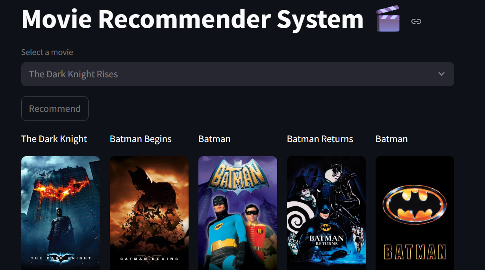

Movie Recommender System 🎬🍿

A content-based movie recommender system that suggests similar movies based on user preferences. It fetches movie posters using the TMDB API and displays recommendations in a clean, interactive interface built with Streamlit.

Features ✨

Personalized Recommendations: Get 5 movies similar to your selection.
Movie Posters: Fetches high-quality posters using the TMDB API.
User-Friendly UI: Simple dropdown selection and recommendation button.
Fast & Efficient: Uses pre-computed similarity scores for quick results.

Tech Stack ⚙️

Python
Pandas (Data Handling)
Scikit-learn (Cosine Similarity)
Streamlit (Web Interface)
TMDB API (Movie Posters)

